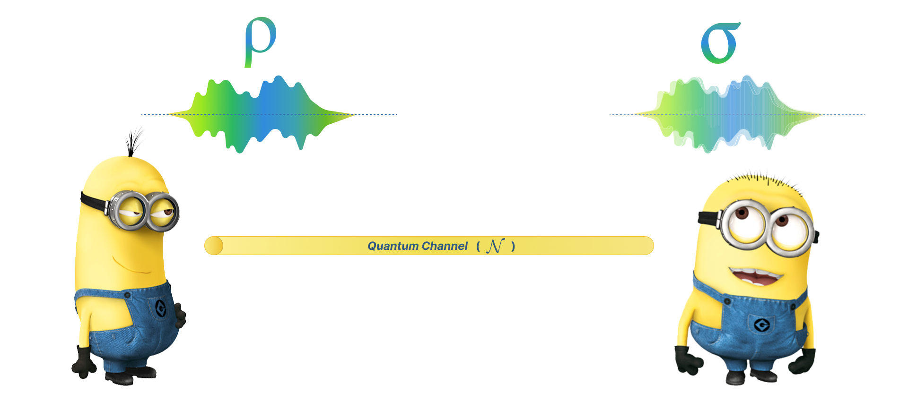

.. QuTIpy documentation master file, created by
   sphinx-quickstart on Thu Jun  9 22:10:58 2022.
   You can adapt this file completely to your liking, but it should at least
   contain the root `toctree` directive.

.. _qutipy-doc-example-quantum-channels:

.. meta::
    :description lang=en:
        New to QuTIpy? Check out the Absolute Beginner’s Guide. It contains an
        introduction to QuTIpy’s main concepts and links to additional tutorials.

Quantum Channels
================

Quantum communication is an evolving field at the intersection of quantum mechanics and information theory.
It leverages the principles of quantum physics to enable secure and efficient data transmission.

Quantum Channel
---------------

A quantum channel (often represented as :math:`\mathcal{N}`) is a fundamental concept in quantum information theory. In classical communication,
information is transmitted through a noisy channel, introducing errors. Similarly, in quantum communication,
a quantum channel models the physical process through which a quantum state is sent from one location to
another, potentially introducing errors, noise, or decoherence.

Suppose 2 minions **Tim** (left) and **Dave** (right) want to communicate with each other, and have a quantum
channel :math:`\mathcal{N}`, pre-eshtablished. Suppose **Tim** wants to send a information represented by the
quantum state :math:`\rho` to **Dave**. This transfer of information through the quantum channel :math:`\mathcal{N}`
will add noise, distortion and errors to the quantum state, transforming the quantum state :math:`\rho` to :math:`\sigma`

Mathematical Representation
---------------------------

Mathematically, a quantum channel is represented as a completely positive, trace-preserving (CPTP) map.
In this example, we focus on an amplitude damping channel, which models the loss of quantum information.
The amplitude damping channel is described by a Kraus operator, and it's action on a quantum state :math:`\rho`
is given by :math:`\sigma = \mathcal{N} ( \rho )`, i.e. :math:`\sigma = \mathcal{N} ( \rho ) = \sum\limits_{i=0}^{r}{K_i \rho K_i^\dagger}` or,
:math:`\sigma = K_1 \rho K_1^\dagger + K_2 \rho K_2^\dagger` in case of an amplitude damping channel.

Where:

* :math:`\sigma`: Transformed quantum state after the channel.
* :math:`\rho`: Original quantum state.
* :math:`K`: Kraus operator representing the amplitude damping channel.
* :math:`K^\dagger`: The conjugate transpose of :math:`K`.

QuTIpy Implementation
---------------------

We utilize several QuTIpy functions and modules in this example:

* :code:`qutipy.channels.amplitude_damping_channel(γ)`: Creates an amplitude damping channel with damping parameter :math:`\gamma`.
* :code:`qutipy.states.random_density_matrix(n)`: Generates a random density matrix representing an initial quantum state with n qubits.
* :code:`qutipy.pauli.nQubit_Pauli_coeff(rho, i)`: Calculates the coefficients of the Pauli matrices for the quantum state :math:`\rho`.
* :code:`qutipy.channels.apply_channel(K, rho)`: Applies the quantum channel :math:`K` to the quantum state :math:`\rho`.
* :code:`qutipy.fidelities.fidelity(rho1, rho2)`: Computes the fidelity between two quantum states :math:`\rho_1` and :math:`\rho_2`.

To simulate the above example of Tim and Dave, we will start with importing the required functionalities from qutipy package.

.. code:: python

    >>> from qutipy.channels import amplitude_damping_channel, apply_channel
    >>> from qutipy.states import random_density_matrix
    >>> from qutipy.pauli import nQubit_Pauli_coeff
    >>> from qutipy.fidelities import fidelity
    >>> import numpy as np

Once the required modules are imported, we can start creating the required components like the
quantum channel and the quantum state. We start with creating our quantum channel first,

.. code:: python

    >>> # Create an amplitude damping channel with a damping parameter of 0.2.
    >>> # K = (K_1, K_2) for amplitude damping.
    >>> K = amplitude_damping_channel(0.2)

The above code creates the kraus operator :math:`K` for the amplitude damping channel, which looks like this:

.. math::
    K_0 = \begin{bmatrix} 1 && 0 \\ 0 && 0.89442719 \end{bmatrix} \\
    K_1 = \begin{bmatrix} 0 && 0.44721360 \\ 0 && 0 \end{bmatrix}

Now that we have our quantum channel :math:`\mathcal{N}` represented by the kraus operator :math:`K`, we can jump
in creating some quantum states to transfer through the channel.

.. code:: python

    >>> # Generate a random density matrix representing an initial quantum state with 2 qubits.
    >>> rho = random_density_matrix(2)

    >>> # Calculate the coefficients of the Pauli matrices for ρ.
    >>> coefficient = nQubit_Pauli_coeff(rho, 1)

    >>> # Verify that the coefficient is equal to 1, indicating a valid quantum state.
    >>> np.testing.assert_almost_equal(coefficient[0], 1)

Here :math:`\rho` is some density matrix in 2 dimension, which looks like this:

.. math::
    \rho = \begin{bmatrix} 0.20384195  && 0.10963633+0.1308432j \\ 0.10963633-0.1308432j && 0.79615805 \end{bmatrix}

We have also calculated the pauli coefficient of :math:`\rho` (which should be near to :math:`1.` ), in order to verify
that the density matrix :math:`\rho` represents a valid quantum state. Now that we have our kraus operator :math:`K` and
the quantum state :math:`\rho`, we can start applying the quantum channel over the quantum state.

.. code:: python

    # Apply the amplitude damping channel K to the quantum state ρ.
    sigma = apply_channel(K, rho)

    # Calculate the Pauli coefficients for the transformed state σ.
    transformed_coefficient = nQubit_Pauli_coeff(sigma, 1)

    # Verify that the transformed coefficient is still 1 due to the channel being trace-preserving.
    np.testing.assert_almost_equal(transformed_coefficient[0], coefficient[0])

    # Check if the transformed coefficients for the rest of the Pauli matrices are different from the original coefficients.
    assert transformed_coefficient[1:] != coefficient[1:]

    # Calculate the fidelity between the original state ρ and the transformed state σ.
    print("Fidelity : ", fidelity(rho, sigma))

Here :math:`\sigma` represents transformed density matrix due to the amplitude damping acting on :math:`\rho`. It
looks something like:

.. math::
    \sigma = \begin{bmatrix} 0.36307356 && 0.09806171+0.11702972j \\ 0.09806171-0.11702972j && 0.63692644 \end{bmatrix}

It is clear that :math:`\rho \ne \sigma` but as the amplitude damping channel is trace-preserving, we can verify
that :math:`coeff_{\rho} \approx coeff_{\sigma} \approx 1`. We can also check that closeness of the quantum state
:math:`\rho` to the quantum state :math:`\sigma` by measuring their **fidelity**, which must be :math:`\approx 1`,
verifying that both :math:`\rho` and :math:`\sigma` nearly represent the same quantum state.