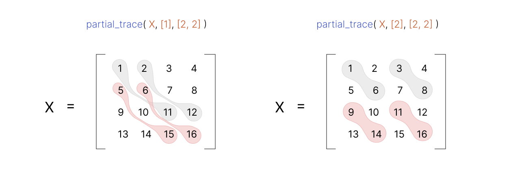

.. QuTIpy documentation master file, created by
   sphinx-quickstart on Thu Jun  9 22:10:58 2022.
   You can adapt this file completely to your liking, but it should at least
   contain the root `toctree` directive.

.. _qutipy-doc-general-functions:

General Functions
=================

Hilbert Space
-------------

The primary mathematical object in quantum theory is the `Hilbert
space <https://en.wikipedia.org/wiki/Hilbert_space>`__. We consider only
finite-dimensional **Hilbert spaces**, denoted by :math:`\mathcal{H}`.
Although we will be considering *finite-dimensional spaces*
exclusively, we note here that many of the statements and claims extend
directly to the case of separable, *infinite-dimensional Hilbert
spaces*, especially for operationally-defined tasks and information
quantities.

A **d**-dimensional Hilbert space :math:`(1 \le d < \infty)` is defined to
be a complex vector space equipped with an inner product. We use the notation
:math:`{\displaystyle |\psi\rangle}` to denote a vector in :math:`\mathcal{H}`.
More generally, a **Hilbert space** is a “**complete inner product**” space.

.. hint::
   **Completeness** is an issue that pops up only
   in *infinite-dimensional spaces*, so all *finite-dimensional
   inner-product spaces* are **Hilbert spaces**.

To read more about Hilber Space, See the `Mathematics - Hilbert Space <./mathematics.html#hilbert-space>`_ .

Bra-Ket Notation
----------------
A **ket** is of the form :math:`{\displaystyle |v\rangle }`. Mathematically it denotes a
`vector <https://en.wikipedia.org/wiki/Vector_space>`__, :math:`{\displaystyle {\boldsymbol {v}}}`,
in an abstract (complex) `vector space <https://en.wikipedia.org/wiki/Vector_space>`__ :math:`{\displaystyle V}`,
and physically it represents a state of some quantum system. An example of a **Ket** can
be :math:`{\displaystyle |r\rangle } = \begin{bmatrix} x \\ y\\ z\end{bmatrix}` represents
a vector :math:`{\displaystyle \vec{r} } =\begin{bmatrix} x \\ y\\ z\end{bmatrix}`.

A **bra** is of the form :math:`{\displaystyle \langle f|}` . Mathematically it denotes a
`linear form <https://en.wikipedia.org/wiki/Linear_form>`__ :math:`{\displaystyle f:V\to \mathbb {C} }`,
i.e. a `linear map <https://en.wikipedia.org/wiki/Linear_map>`__ that maps each vector
in :math:`{\displaystyle V}` to a number in the complex plane :math:`{\displaystyle \mathbb {C} }`.
Letting the linear functional :math:`{\displaystyle \langle f|}` act on a vector :math:`{\displaystyle |v\rangle }`
is written as :math:`{\displaystyle \langle f|v\rangle \in \mathbb {C} }`.
The **bra** is similar to the **ket**, but the values are in a **row**, and each element is the complex
`conjugate <https://en.wikipedia.org/wiki/Complex_conjugate>`__ of the **ket**\ ’s elements.

In the simple case where we consider the vector space :math:`{\displaystyle \mathbb {C} ^{n}}`,
a **ket** can be identified with a `column vector <https://en.wikipedia.org/wiki/Column_vector>`__,
and a **bra** as a `row vector <https://en.wikipedia.org/wiki/Row_vector>`__.

Meaning :
~~~~~~~~~

:math:`{\displaystyle \langle A| }=\begin{bmatrix}A_1&A_2&A_3&\dots\end{bmatrix} \qquad \& \qquad  {\displaystyle |B\rangle}=\begin{bmatrix}B_1\\B_2\\B_3\\\vdots\end{bmatrix}`

Example:
^^^^^^^^

:math:`{\displaystyle |0\rangle }=\begin{bmatrix}1\\0\end{bmatrix}` , for two dimensional Hilbert Space,
Defining a basis state :math:`{\displaystyle |0\rangle }`, we can use the ``ket`` module like this:

.. code:: python

   >>> from qutipy.general_functions import ket
   >>> # Defining a ket 0 in a 2 Dimensional Hilbert space,
   >>> # The first argument takes a dimension of the Hilbert space,
   >>> # while the secind argument takes the ket value.
   >>> v = ket(2,0)
   array([[1.],
          [0.]])

Here we have defined the **ket** v for :math:`{\displaystyle |v\rangle } = \begin{bmatrix} 1 \\ 0 \end{bmatrix}`.
In numpy, defining the same would need one to define the matrix manually.

Tensor Product
--------------

The :ref:`qutipy-doc-tensor-product` is a way of combining two mathematical objects to
create a new object that captures their combined properties.

More specifically, given two vector spaces :math:`V` and :math:`W`, the tensor product
:math:`V \otimes W` is a new vector space that represents all possible combinations of
linear combinations of elements from :math:`V` and :math:`W` .

.. code-block:: python

   >>> from qutipy.general_functions import tensor
   >>> V = np.array([[ 1,  2,  3,  4],
   >>>               [ 5,  6,  7,  8],
   >>>               [ 9, 10, 11, 12],
   >>>               [13, 14, 15, 16]])
   >>> W = np.array([[2, 4]])
   >>> tensor(V, W)

   array([[ 2,  4,  4,  8,  6, 12,  8, 16],
          [10, 20, 12, 24, 14, 28, 16, 32],
          [18, 36, 20, 40, 22, 44, 24, 48],
          [26, 52, 28, 56, 30, 60, 32, 64]])

Partial Trace
-------------

The trace of a linear operator X acting on a :math:`d`-dimensional Hilbert space can be written as

.. math::
   Tr[X] = \sum\limits_{i=0}^{d-1} \langle i|X|i \rangle

where :math:`\{ |i\rangle_{i=0}^{d-1} \}` is the standard orthonormal basis. We can interpret the trace as
the sum of the diagonal elements of the matrix corresponding to :math:`X`` written in the
standard basis.

A **Partial Trace** is a Trace :math:`Tr[B]`, acting on a part of a bipartite quantum state. More
specifically, given a state :math:`\rho_{AB}` for the bipartite system :math:`AB`, we are often interested
in determining the state of only one of its subsystems. The partial trace :math:`Tr[B]`,
which we define formally below, takes a state :math:`\rho_{AB}` acting on the space :math:`H_{AB}`
and returns a state :math:`\rho_{A} \equiv Tr_B[\rho_{AB}]` acting on the space :math:`H_A`.

The partial trace is therefore the mathematical operation
used to determine the state of one of the subsystems given the state of a composite
system comprising two or more subsystems, and it can be thought of as the action
of “discarding” one of the subsystems.

The partial trace generalizes the notion of marginalizing a joint probability distribution.

Using Partial Trace with QuTIpy is as easy is calling a function definition ``partial_trace`` from ``qutipy.general_functions``.

Let's assume X for, :math:`X = \rho_{AB} = \begin{bmatrix} 1 & 2 & 3 & 4 \\ 5 & 6 & 7 & 8 \\ 9 & 10 & 11 & 12 \\ 13 & 14 & 15 & 16 \end{bmatrix}`

.. code-block:: python

   >>> import numpy as np
   >>> # Defining the State X
   >>> X = np.array(
   >>>    [
   >>>       [ 1,  2,  3,  4],
   >>>       [ 5,  6,  7,  8],
   >>>       [ 9, 10, 11, 12],
   >>>       [13, 14, 15, 16]
   >>>    ]
   >>> )

Now that we have our system, we can calculate the Partial Trace of X, i.e. :math:`\rho_{AB}`.
Assuming A for, :math:`A = \rho_A \equiv Tr_B[\rho_{AB}]`,

.. code-block:: python

   >>> from qutipy.general_functions import partial_trace
   >>> # Applying Partial Trace over X, which is a bipartite state
   >>> # with 2 the dimension of system A and 2 the dimension of system B,
   >>> A = partial_trace(X, [2], [2, 2])
   >>> A
   array([[ 7, 11],
          [23, 27]])

Partial Transpose
-----------------

The Partial Transpose plays an important role in quantum information
theory due to its connection with entanglement. In fact, it leads to a
sufficient condition for a bipartite state to be entangled.

Given quantum systems :math:`A` and :math:`B`, the partial transpose
on :math:`B` is denoted by :math:`T_B\equiv id_A \otimes T_B`, and it is defined as,

.. math::

   T_B(X_{AB})  :=  \sum\limits^{d_B-1}_{j, j'=0}   (\mathbf{1}_A  \otimes
   |i\rangle \langle{i'}|_B)  X_{AB}  (\mathbf{1}_A  \otimes  |i\rangle \langle{i'}|_B)

``partial_transpose(...)`` is a function that computes the partial
transpose of a matrix. The transposition may be taken on any subset of
the subsystems on which the matrix acts.

Let us define a matrix ``X`` as follows:

.. code:: python

   >>> import numpy as np
   >>> X = np.array(
   >>>     [
   >>>         [ 1,  2,  3,  4],
   >>>         [ 5,  6,  7,  8],
   >>>         [ 9, 10, 11, 12],
   >>>         [13, 14, 15, 16]
   >>>     ]
   >>> )

Now we can apply the ``partial_transpose`` function over our matrix ``X``:

.. code:: python

   >>> from qutipy.general_functions import partial_transpose
   >>> pt = partial_transpose(X, [2], [2, 2])
   >>> pt
   array([[ 1,  5,  3,  7],
          [ 2,  6,  4,  8],
          [ 9, 13, 11, 15],
          [10, 14, 12, 16]])

